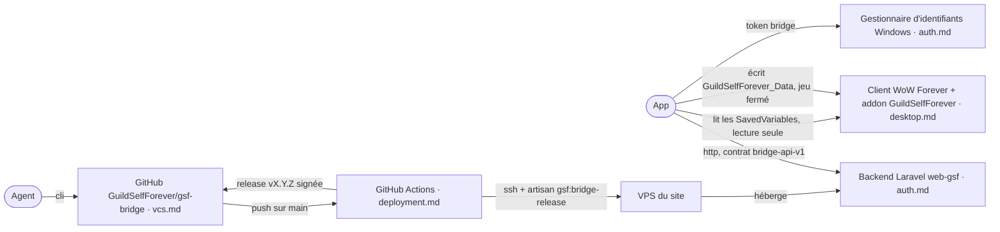

# Ecosystem

```mermaid
flowchart LR
  Agent([Agent])
  App([App])
  Vcs["GitHub GuildSelfForever/gsf-bridge · vcs.md"]
  Actions["GitHub Actions · deployment.md"]
  Web["Backend Laravel web-gsf · auth.md"]
  Vps["VPS du site"]
  Wow["Client WoW Forever + addon GuildSelfForever · desktop.md"]
  Keyring["Gestionnaire d'identifiants Windows · auth.md"]

  Agent -- cli --> Vcs
  App -- "http, contrat bridge-api-v1" --> Web
  App -- "lit les SavedVariables, lecture seule" --> Wow
  App -- "écrit GuildSelfForever_Data, jeu fermé" --> Wow
  App -- "token bridge" --> Keyring

  Vcs -- "push sur main" --> Actions
  Actions -- "release vX.Y.Z signée" --> Vcs
  Actions -- "ssh + artisan gsf:bridge-release" --> Vps
  Vps -- "héberge" --> Web
```
